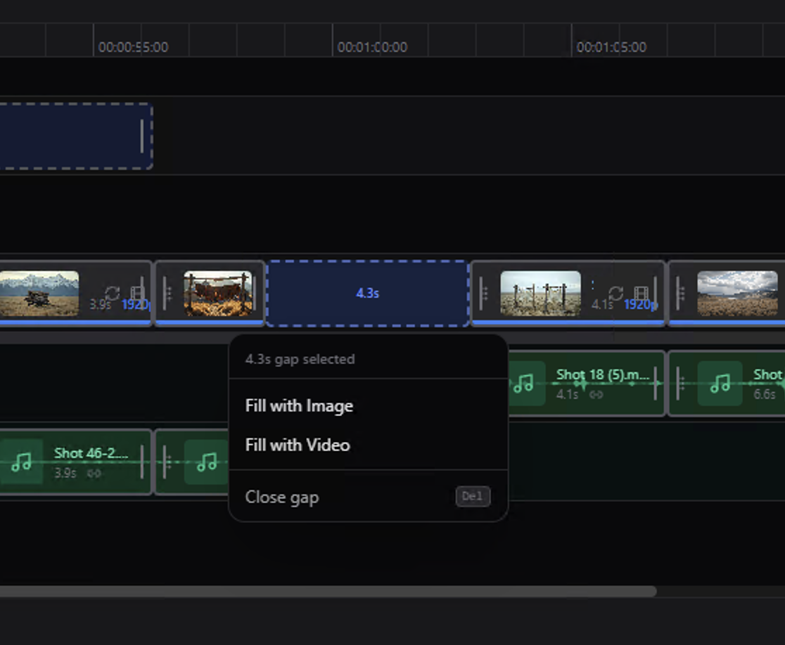

# LTX-2.3

**LTX-2.3** is an open-source generative video architecture based on the Diffusion Transformer (DiT). The model delivers commercial-grade generation quality (on par with Google Veo 3) but without the strict limitations of closed ecosystems. The project supports both fully autonomous local inference and hybrid cloud processing.

  <video src="https://github.com/user-attachments/assets/4414adc0-086c-43de-b367-9362eeb20228" width="70%" poster=""> </video>

---

## 🚀 Key Features

* **Text-to-video** generation
* **Image-to-video** generation
* **Audio-to-video** generation
* **Video edit** generation (Retake)
* **Video Editor** Interface
* **Video Editing** Projects

---
## 🚀 Features

* **Commercial-Grade Quality:** Spatiotemporal consistency, photorealism, and object physics are on par with closed proprietary models (Veo 3, Sora).
* **Flexible Deployment (Local / Cloud):** * *Local:* Completely unlimited generation on your own hardware.
* *Cloud:* Integrated cloud rendering for low-end PCs (queue wait times depend on server load).

* **Base Generation Parameters:** Native output of 10 seconds at 24 FPS in 1080p resolution in a single pass.
* **4K Cloud Rendering:** Integrated upscaling and native generation in 4K. A limit of **10 generations per day** applies for cloud usage (to prevent server overload). *Note: Video editing operations (V2V, Inpainting, Motion Brush) do not consume the 4K generation quota.*
* **Spatiotemporal Attention & $v$-prediction:** An optimized mathematical noise prediction model that minimizes visual artifacts in highly dynamic scenes.
* **Fully Uncensored** 
---

  

  

  

---

## 📊 Model Comparison

### LTX-2.3 vs LTX-2.0

| Feature | LTX-2.0 | LTX-2.3 (Current) |
| --- | --- | --- |
| **Architecture** | DiT-Lite | Full-scale DiT with Spatiotemporal Attention |
| **Base Resolution** | 720p | 1080p (4K support) |
| **Generation Length** | 4-5 seconds | 10 seconds (seamless) |
| **Prompt Adherence** | Medium | High (understands multi-layered lighting and cinematography) |
| **VRAM Consumption (Min)** | 12 GB | 8 GB (thanks to new quantization algorithms) |

### LTX-2.3 vs VEO 3

| Feature | LTX-2.3 | VEO 3 (Closed Source) |
| --- | --- | --- |
| **Diffusion Model** | Open Source / Local / Cloud | Closed Cloud API |
| **Limits (1080p)** | Absolutely unlimited (Local) | Strict quotas (Credits) |
| **Limits (4K)** | Unlimited (Local) / 10 per day (Cloud) | Paid Tier |
| **Physics Simulation Quality** | High (Custom Motion Buckets) | High |
| **Weights Access & Fine-tuning** | Yes (LoRA, ControlNet) | No |
| **Content Restrictions** | **None (Fully Uncensored)** | Strict safety guidelines (Censored) |

---

## 💻 System Requirements

LTX-2.3 utilizes dynamic CPU offloading and 8-bit/4-bit quantization, allowing the model to run smoothly on mid-range PCs. It won't run on a "potato," but basic modern systems are sufficient.

| Component | Minimum Requirements (Local) | Recommended Requirements (Local 4K) | Cloud Mode |
| --- | --- | --- | --- |
| **OS** | Windows 10/11, macOS 13+, Linux | Windows 11, Ubuntu 22.04 LTS | Any |
| **CPU** | 6-core (Intel i5 12th gen / AMD Ryzen 5) | 8-core+ (Intel i7 / AMD Ryzen 7) | Any |
| **RAM** | 16 GB DDR4 | 32 GB DDR5 | 8 GB |
| **GPU** | NVIDIA RTX 4060 (8 GB VRAM) | NVIDIA RTX 4080 / 4090 (16+ GB VRAM) | Not required |
| **Storage** | 25 GB (SSD) for model weights | 50 GB (NVMe SSD) for cache and video | 500 MB |

> **Note:** macOS users (Apple Silicon M2/M3/M4) can use the Metal framework (MPS) for hardware acceleration. The expected generation time for a 10s 1080p video on an M3 Max is ~4-6 minutes.

---

## 🛠 Installation

The easiest way to get started is by using the pre-built binaries with an integrated UI. You do not need to install Python or set up virtual environments.

1. Go to the [Releases](../../releases) page.
2. Download the installer for your OS:
* **Windows:** `LTX-2.3_Installer_x64.exe`
* **macOS:** `LTX-2.3_Installer_macOS.dmg`

3. Run the installer and follow the on-screen instructions. The installer will automatically download the necessary base model weights (approx. 18 GB).

---

## ✍️ Prompting for LTX-2

When writing prompts, focus on detailed, chronological descriptions of actions and scenes. Include specific movements, appearances, camera angles, and environmental details - all in a single flowing paragraph. Start directly with the action, and keep descriptions literal and precise. Think like a cinematographer describing a shot list. Keep within 200 words. For best results, build your prompts using this structure:

- Start with main action in a single sentence
- Add specific details about movements and gestures
- Describe character/object appearances precisely
- Include background and environment details
- Specify camera angles and movements
- Describe lighting and colors
- Note any changes or sudden events

### Automatic Prompt Enhancement

LTX-2 pipelines support automatic prompt enhancement via an `enhance_prompt` parameter.

## 🔌 ComfyUI Integration

To use our model with ComfyUI, please follow the instructions at [ComfyUI-LTX-2.3](https://github.com/LTX-desktop/ComfyUI-LTX-2.3).

---

## ❓ FAQ

**Q: How fast is text-to-video generation?**
**A:** Speed depends on your hardware and the selected mode. When running locally on a flagship GPU (e.g., RTX 4090), generating a base clip (10 seconds, 1080p, 24 FPS) takes about **4–6 minutes**. In cloud mode (Cloud Engine), the rendering itself takes 1-2 minutes, but there may be wait times depending on the server queue.

**Q: How many GBs does the entire model weigh?**
**A:** The base optimized package (in FP8 format, which our installer downloads) weighs about **18–20 GB**. This volume includes the diffusion weights (UNET), the autoencoder (VAE), and the text encoders (T5). The full uncompressed version (BF16) for server hardware takes up around **40 GB**.

**Q: Can it be integrated into ComfyUI?**
**A:** Yes, the model works perfectly within the ComfyUI ecosystem thanks to its component-based structure. You will need custom nodes (e.g., `ComfyUI-LTX-Wrapper`), and the weights themselves are distributed across the `/models/unet/`, `/models/clip/`, and `/models/vae/` directories. You can use our official `.exe` updater to automatically download and place all the necessary files [ComfyUI-LTX-2.3](https://github.com/LTX-desktop/ComfyUI-LTX-2.3).

**Q: What graphics card is needed for a comfortable local launch?** 
**A:** Thanks to quantization algorithms, the minimum threshold to run is **12 GB VRAM** (e.g., RTX 3060 12GB), but generation will be slower due to partial data offloading to system RAM. The recommended capacity for comfortable and fast 1080p performance is **16–24 GB VRAM** (RTX 4080, RTX 3090/4090).

**Q: Are there any hidden usage limits?**
**A:** Local generation (Local Engine) is **absolutely unlimited** and free. Restrictions only apply to the cloud mode (Cloud Engine): base generation in 1080p is unlimited, but rendering in 4K resolution has a quota of **10 generations per day** per account to prevent server overload.

